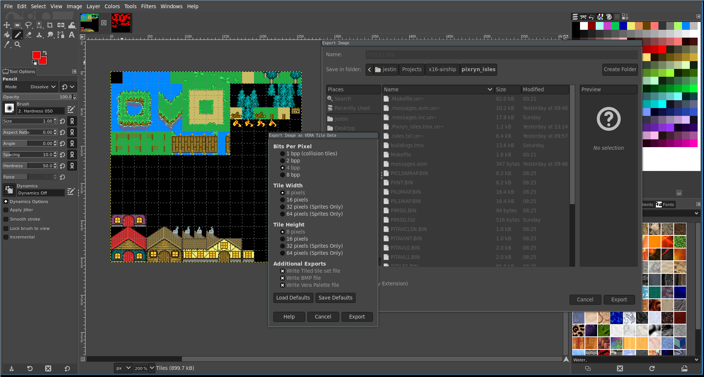
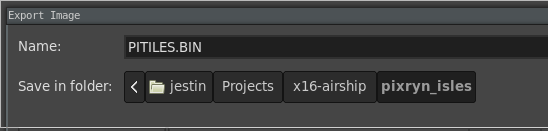
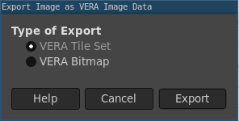
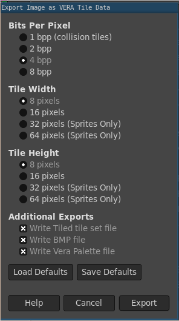
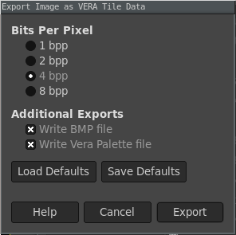
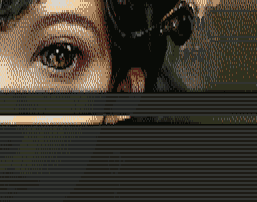
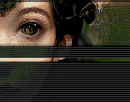
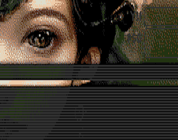

# gimp-vera-tileset-plugin

A gimp plugin for creating tilesets for the VERA graphics chip.



The [VERA graphics chip](https://github.com/fvdhoef/vera-module) that is being
used by the Commander X16 modern retro computer can render graphics based on
the contents of its onboard video RAM, but those contents need to be in a
specific format.  This plugin is able to produce binary files in that format,
which can then by loaded into the VERA's video RAM for display.  This includes
the ability to export palette binaries that can also be loaded into the VERA.
Additionally, this plugin is able to produce simple tileset files that are
compatible with the [Tiled](https://github.com/mapeditor/tiled) tile mapping
application.  This can then be used in conjunction with
[tmx2vera](https://github.com/jestin/tmx2vera), a Tiled to VERA converter
application, which allows for game engine style development for Commander X16
games and applications.

## Compilation and Installation

### Linux

To install this plugin, you need to make sure your system has `gimptool-2.0`
installed.  This GIMP-provided command line tool is used by the plugin's
`Makefile` in order to specify includes and library dependencies, as well as
facilitate installation of the plugin.  If all the appropriate GIMP development
dependencies are installed, you should be able to compile and install with:

```
$ make
$ make install
$ sudo make install-ui
```

### Windows
<!--section made by Adiee5-->


Things become significantly more complicated here, because Windows comes without any kind of C compiler and installing a tui compiler's significantly harder than it is on linux. Using IDEs wasn't tested yet, but it's probably not possible.

So first, we need to install [MSYS2](https://www.msys2.org/), don't change the location of the install, because the `win.lxml2fix.bat` relies on it heavely; then we'll need to run it in **MinGW64** (or theoretically **MinGW32**, but i highly doubt anyone uses 32bit windows at this point). When in it, you'll need profilactically type in the `pacman -Syyuu`, next type in the `pacman -S mingw-w64-Ж-gimp` with `Ж` needing to be replaced with either `x86_64` or `i686` depending on whenether you want to compile for **64** or **32(i686)** bits, and then install the [Stable GIMP 2.10 dependencies](https://developer.gimp.org/core/setup/build/windows/#stable-branch-gimp-210-dependencies). Next type in the 
```
git clone https://github.com/jestin/gimp-vera-tileset-plugin.git
cd gimp-vera*
```
in order to download the source code. Then type `explorer .` to open downloaded folder in File Manager and run the `win.lxml2fix.bat` (you may want to run this as an **admin**). After all of that you'll have to type into **MSYS2**: 
```
gimptool-2.0 -n --build vera_tileset.c > win.localcomp.sh
echo " -lxml2" >> win.localcomp.sh 
./win.localcomp.sh
explorer .
```
Finally, check if you have any **.exe** files in the folder . If so, then run `win.apply.bat` to put files in correct places (You may want to run it with an admin). Now you can enjoy the plugin. You can now theoretically **uninstall the MSYS2** if you want to. For additional information have a look at [this issue](https://github.com/jestin/gimp-vera-tileset-plugin/issues/4).

## Usage

The plugin defines both interactive and non-interactive run modes, so you can
use it through a user interface from within GIMP, or from the command line with
scripts.  In either case, the plugin requires that you set your image to
_Indexed_ mode (using a palette to reference your colors).

### Interactive Mode

The plugin defines the `*.BIN` file export, so you first need to export your
image with the `.BIN` extension.  This will run the plugin to perform the
export.



Hit "Export" to continue, and you will be prompted for whether you wish to
export a tile set or a bitmap.



If you choose to export a tile set, you will be promoted for some details about
the tiles, and also about additional exports such as VERA-compatible palette
file, Tiled tileset file, and a BMP file to be used with Tiled tilesets.
Choose the correct settings for your needs.  You also choose whether or not you
want a 2-byte header added to the file, which is often a convention on
Commodore and Commodore-like computers.  If selected, this header will be added
to all VERA-compatible file outputs, including bitmaps, tile sets, and palette
files.



If you choose to export a bitmap instead of tiles, you will be shown a
different dialog with more limited settings.



Both of these types of exports will result in files that can be loaded directly
into the VERA's VRAM using the `SETLFS`, `SETNAM`, and `LOAD` routines of the
Commander X16 Kernal.

### Non-Interactive Mode

Alternatively, you may want to export your graphics resources by way of a build
system such as GNU `make`.  For those situations, it is best to script the
export of your resources from your build system.  For this to be done, you will
need to create a script to call the plugin and put it in your GIMP scripts
directory.  This script should work for most use cases:

```
(define (export-vera filename
					 outfile
					 export-type
					 file-header
					 tile-bpp
					 tile-width
					 tile-height
					 tiled-file
					 bmp-file
					 pal-file)
  (let* ((image (car (gimp-file-load RUN-NONINTERACTIVE filename filename)))
		(drawable (car (gimp-image-get-active-layer image))))
  (file-vera-save RUN-NONINTERACTIVE
				  image drawable outfile outfile export-type file-header tile-bpp tile-width tile-height tiled-file bmp-file pal-file)
  (gimp-image-delete image)))
```

Name this file something like `vera_export.scm` and place it in the GIMP
scripts directory for your particular installation.  On Ubuntu, the correct
directory is `~/.config/GIMP/2.10/scripts/`, replacing `2.10` for your version
of GIMP.

With that in place, you can now run both GIMP and the plugin non-interactively
from a `Makefile` or build script:

```
MYTILES.BIN: MyTiles.xcf
	gimp -i -b '(export-vera "MyTiles.xcf" "MYTILES.BIN" 0 0 8 16 16 0 1 0)' -b '(gimp-quit 0)'
```

This exports the tiles in MyTiles.xcf as a VERA tile set, at 8 bits per pixel,
16 pixel width, 16 pixel height, without created a Tiled tileset file, with
creating a corresponding BMP, and without writing out a VERA-compatible palette
file.  Whenever `make` detects a change in `MyTiles.xcf`, it will re-run this
command.  This makes it such that you only need to save your GIMP project, and
`make` will determine when your resources need to be exported and when they
don't.


You can also create other useful GIMP scripts that use the `file-vera-save`
procedure that the plugin defines.  For example, you may want to design an
image at a larger resolution (perhaps for some box art, promotional materials,
etc.) but still have it converted to a bitmap for use by the VERA.  In this
case, you could write a script that crops, scales, converts to indexed mode,
and finally exports the output using the `file-vera-save` procedure:

```
(define (make-vera-bitmap filename
					 outfile
					 file-header
					 orig-width
					 orig-height
					 bpp
					 bmp-file
					 pal-file)
  (let* (
		 (image (car (gimp-file-load RUN-NONINTERACTIVE filename filename)))
		 (drawable (car (gimp-image-get-active-layer image)))
		 (cropped-width (/ (* 320 orig-height) 240))
		 (x-off (/ (- orig-width cropped-width) 2))
		 )
	(gimp-image-crop image cropped-width orig-height x-off 0)
	(gimp-image-scale image 320 240)
	(gimp-image-convert-indexed image CONVERT-DITHER-FIXED CONVERT-PALETTE-GENERATE (expt 2 bpp) 0 0 "")
	(file-vera-save RUN-NONINTERACTIVE
					image drawable outfile outfile 1 file-header bpp 8 8 0 bmp-file pal-file)
	(gimp-image-delete image)
	)
  )
```

With this script defined and placed in the scripts directory, you can now
create a make target that generates a VERA bitmap binary from a much higher
resolution GIMP project:

```
MYBITMAP.BIN: MyBitmap.xcf
	gimp -i -d -f -b '(make-vera-bitmap "MyBitmap.xcf" "MYBITMAP.BIN" 0 1920 1080 4 1 1)' -b '(gimp-quit 0)'
```

Now you can create your artwork in a more professional quality and have it
automatically converted to a format that can be used by your application.


## VERA Colormap Conversion

In addition to the tile and bitmap exports, this plugin includes a tool for
viewing artwork with the colors that will be displayed on the VERA.  While the
GIMP's colormap uses 8 bits per channel to define a color, the VERA's palette
uses 4 bits per channel.  This inevitably leads to some slight color
differences from what is displayed in the GIMP.  While these differences are
very minor, this problem can be mitigated.

This plugin adds a "Convert to VERA compatible colors" feature under Colors ->
Map.  This will modify the colors in your image's colormap to more accurately
display how those existing colors will render on the VERA.  Due to the
downgrading of the color space that already takes place during a VERA export,
running this tool will have no effect on the export of the image.  It's simply
changing the least significant bits that are discarded on export.  However, the
colors in the GIMP will now be closer to how they will appear on the VERA
hardware.

For example, here is a 16-color image shown in GIMP:



And here is how that image renders on the VERA:



After running "Convert to VERA compatible colors", the image in GIMP now looks like:



While still not perfect (especially when taking into account different monitors
and different emulator implementations) the image can now be edited with colors
closer to how they will eventually be rendered.  Meanwhile, the exported
palette is still bit-for-bit identical to what was export prior to running the
tool.

## Video Demonstrations

Tools Overview:

[](https://www.youtube.com/watch?v=ATiwyTGiSc4)

Collision Detection:

[](https://www.youtube.com/watch?v=HCEfZ3UPACM)
